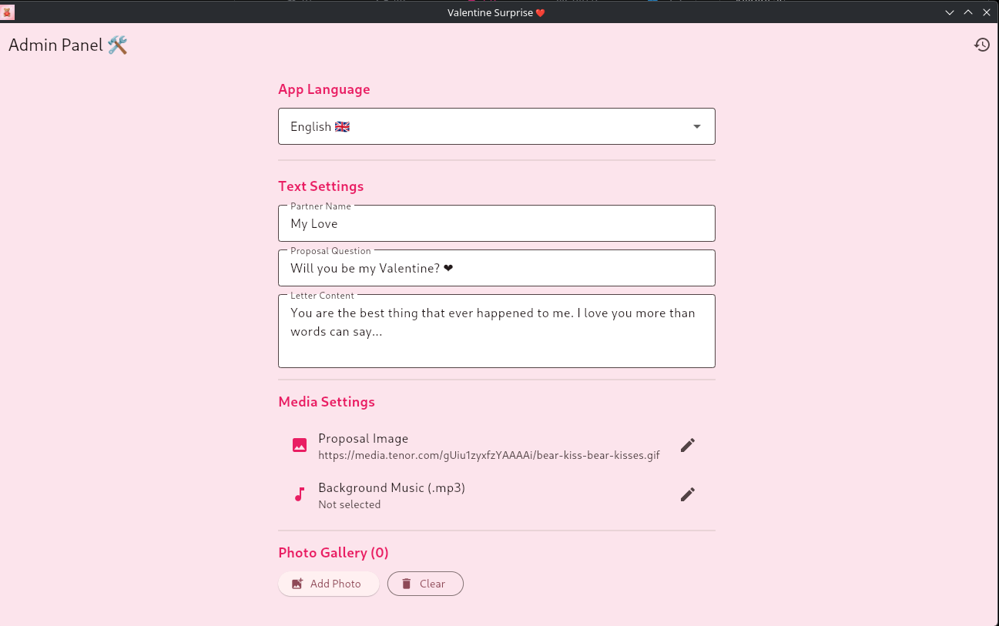
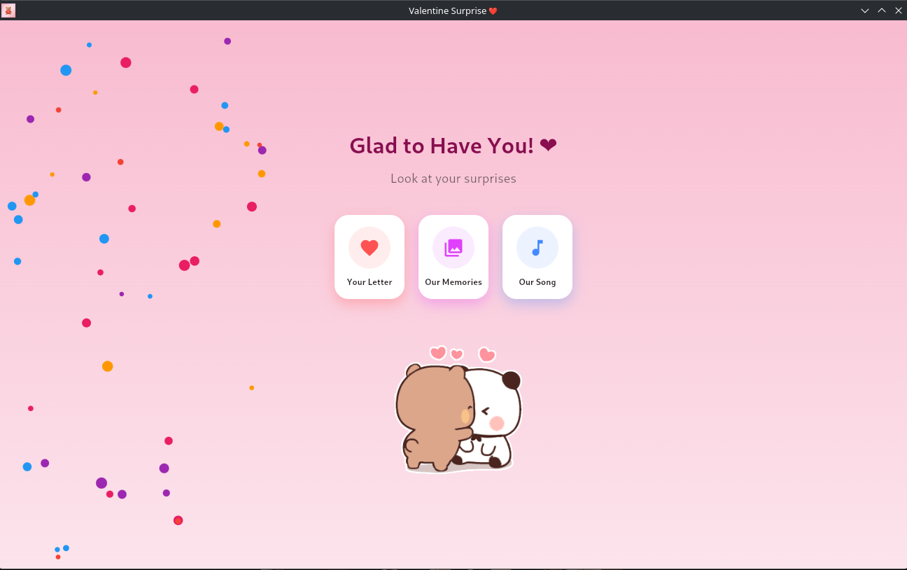
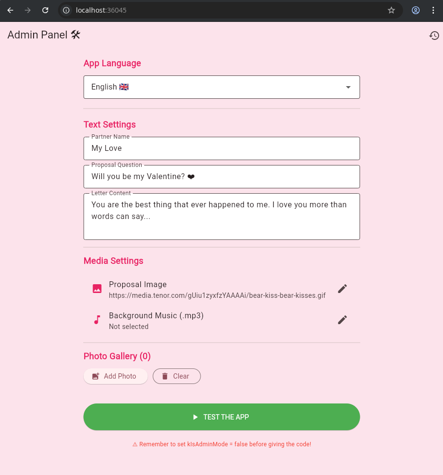

# Valentine Surprise

Partneriniz için tamamen kişiselleştirilebilir, duygusal bir sürpriz hazırlamanızı sağlayan Flutter tabanlı teklif uygulaması. Mektup içeriğinden arka plan müziğine, fotoğraf galerisinden özel sorulara kadar her detayı kod yazmadan uygulama içinden yönetebilirsiniz.

Bu proje **Schweis Cooperative** tarafından geliştirilmektedir.

## 📱 Çoklu Platform Desteği
Uygulama, modern cihazların neredeyse tamamında çalışacak şekilde tasarlandı:
- **Android & iOS:** Mobil cihazlarda taşınabilir sürpriz deneyimi.
- **Windows, macOS & Linux:** Masaüstü bilgisayarlar için yüksek kaliteli ses ve görüntü desteği.
- **Web:** Tarayıcı üzerinden hızlı erişim.

---

## 📸 Önizleme
<p align="center">
  
  
  
</p>

---

## 🔥 Temel Özellik: Akıllı Admin Paneli
Klasik kişiselleştirilebilir uygulamaların aksine, Valentine Surprise içinde gizli bir **Admin Mode** ile gelir.
- **Anlık Düzenleme:** İsimleri, teklif sorusunu ve mektup metnini doğrudan uygulama içinden değiştirin.
- **Otomatik Dosya Eşitleme:** Admin panelinden bir fotoğraf veya MP3 seçtiğinizde, uygulama bu dosyayı otomatik olarak projenin `assets/` klasörüne kopyalar.
- **Paketlenmeye Hazır:** Geliştirme aşamasında ayarlarınızı yaptıktan sonra dosyalarınız zaten doğru klasöre gitmiş olur; build aldığınızda (APK, EXE vb.) her şey uygulamanın içine gömülü gelir.

---

## 🛠️ Kurulum ve Yapılandırma

### Gereksinimler
- Flutter SDK (3.10.0 veya üzeri)
- `libmpv-dev` (Linux'ta yüksek kaliteli ses desteği için önerilir)

### Adımlar
1. **Projeyi Klonlayın:**
   ```bash
   git clone https://github.com/Schweis-Cooperative/valentine-surprise.git
   cd valentine-surprise
   ```
2. **Paketleri Yükleyin:**
   ```bash
   flutter pub get
   ```
3. **Admin Modunu Açın:**
   `lib/core/constants/app_constants.dart` dosyasını açın ve şu satırı `true` yapın:
   ```dart
   static const bool kIsAdminMode = true;
   ```
4. **Çalıştır ve Yapılandır:**
   Uygulamayı tercih ettiğiniz platformda başlatın:
   ```bash
   flutter run
   ```
   Açılan Admin panelinden sevgilinizin adını girin, mektubunuzu yazın, şarkınızı ve fotoğraflarınızı seçin.

5. **Tamamla:**
   Önizlemeden memnun kaldığınızda `kIsAdminMode = false` yapın ve son paketi oluşturun:
   ```bash
   flutter build apk --release
   ```

---

## ⚖️ Lisans
**Schweis Cooperative** projesidir. Topluluk kullanımı için tüm hakları saklıdır.
